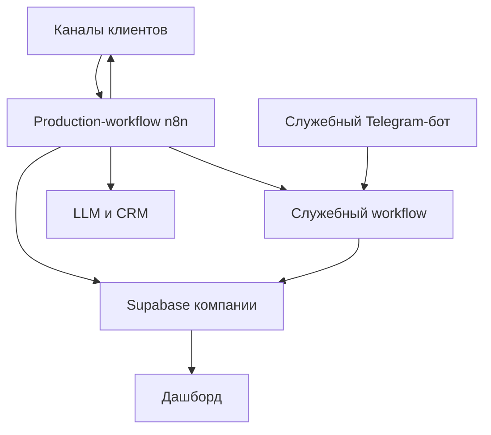

# Архитектура проекта

Статус: согласованная концептуальная архитектура. Точные таблицы, SQL и ноды будут создаваться по активному плану.

## Цель

Один эталонный шаблон должен разворачиваться для разных компаний с минимальным количеством изменений. Логика CORE остаётся одинаковой, а данные компаний изолируются.

## Основные принципы

1. Один продукт компании — один production-workflow n8n.
2. Telegram, Авито, сайт, VK, MAX и другие источники — адаптеры одного продукта.
3. После нормализации CORE не зависит от источника сообщения.
4. Ответ возвращается в исходный канал и диалог.
5. Каждая компания имеет отдельную schema Supabase одинаковой структуры.
6. Supabase хранит данные, знания и технические события, но не управляет логикой CORE.
7. Секреты хранятся только в n8n Credentials или серверных переменных.
8. Дашборд читает подготовленные данные и не получает административный ключ Supabase в браузере.
9. Центральные технические сервисы не копируются в каждый клиентский workflow.

## Компоненты

| Компонент | Назначение |
|---|---|
| Production-workflow компании | Приём обращения, CORE, интеграции и ответ |
| Supabase | Диалоги, сообщения, этапы, цели, анализ, логи и база знаний |
| LLM | Ответы, классификация и последующий анализ диалога |
| CRM | Получение квалифицированных обращений |
| Дашборд руководителя | Метрики, воронка, диалоги и качество работы |
| Админ-панель | Оформление дашборда и безопасные настройки отображения |
| Служебный Telegram-бот | Загрузка документов и системные уведомления |
| VSCode | Разработка дашборда, программного кода и тестов |
| GitHub | Исходный код, документация, безопасные JSON и SQL |

## Общая схема



## Production-workflow компании

```text
Входной адаптер
    ↓
Нормализация
    ↓
Сохранение входящего сообщения
    ↓
CORE
    ├─ анонимизация
    ├─ история и контекст
    ├─ поиск знаний
    ├─ LLM
    ├─ проверка ответа
    ├─ этап диалога
    └─ достигнутые цели
    ↓
Интеграции и CRM
    ↓
Выходной адаптер
    ↓
Сохранение исходящего сообщения и результата доставки
```

Входящее сообщение сохраняется до вызова LLM. Поэтому обращение не теряется при сбое дальнейшей обработки.

## Напоминания

В production-workflow добавляется запуск по расписанию.

```text
Бот отправил вопрос, требующий ответа
    ↓
20 минут без ответа
    ↓
Напоминание №1
    ↓
24 часа без ответа
    ↓
Напоминание №2
    ↓
Ещё 24 часа без ответа
    ↓
Потеря: нет ответа
```

Время следующего действия хранится в Supabase. Запуск по расписанию выбирает просроченные действия, проверяет возможность отправки в исходный канал и записывает результат.

Ответ пользователя отменяет ожидающие напоминания. Возвращение потерянного пользователя возобновляет диалог или создаёт новый без удаления старой истории.

## Служебный Telegram-бот

Служебный бот используется Павлом для:

- загрузки документов базы знаний в формате Markdown;
- получения результата обработки документа;
- получения уведомлений об ошибках и недоступности интеграций.

Он является отдельным техническим сервисом, а не каналом общения с клиентами.

Один Telegram-бот должен иметь одну точку получения обновлений. Поэтому служебный бот подключается к одному центральному workflow, а не к каждой клиентской копии. Это следует из модели Telegram Bot API, где `setWebhook` задаёт один URL: https://core.telegram.org/bots/api#setwebhook

Требования безопасности:

- доступ только разрешённым Telegram user ID;
- явный выбор компании или schema перед загрузкой;
- подтверждение цели загрузки;
- запрет выполнения произвольных команд;
- отсутствие секретов и исходных клиентских переписок в уведомлениях;
- журнал всех административных действий.

## Загрузка базы знаний

Предварительный поток:

```text
Павел отправляет .md
    ↓
Проверка пользователя и выбранной компании
    ↓
Проверка файла
    ↓
Сохранение оригинала и контрольной суммы
    ↓
Очистка и разбор структуры
    ↓
Деление на чанки
    ↓
Создание embeddings
    ↓
Проверочная индексация
    ↓
Публикация новой версии
    ↓
Отчёт Павлу в Telegram
```

Точная очистка, размер чанков, перекрытие, метаданные и модель embeddings будут определены на следующем этапе.

## Supabase

Каждая schema компании содержит одинаковые группы данных:

- пользователи и идентификаторы каналов;
- диалоги и сообщения;
- история этапов;
- целевые события;
- напоминания;
- результаты анализа диалогов;
- обратная связь;
- технические и интеграционные события;
- документы, чанки и embeddings;
- настройки оформления дашборда.

Точные сущности описаны в [словаре данных](DATA_DICTIONARY.md).

## Дашборд

Дашборд получает данные из одной schema компании через подготовленные представления или серверный API.

Разделы руководителя:

1. общая картина;
2. конверсии;
3. потери;
4. воронка этапов;
5. каналы;
6. качество диалогов;
7. список переписок;
8. обратная связь.

Админ-панель Павла управляет только безопасными параметрами:

- название компании;
- логотип;
- цвета;
- часовой пояс;
- отображаемые блоки;
- подписи и порядок этапов;
- период по умолчанию.

Credentials, prompts, выбор CRM и CORE не редактируются через дашборд первой версии.

## Системные уведомления

Production-workflow и служебные workflow отправляют уведомления через служебного Telegram-бота.

Минимальное уведомление содержит:

- компания или экземпляр;
- workflow;
- компонент;
- краткий тип ошибки;
- время;
- идентификатор выполнения;
- ссылку на безопасный технический журнал, если она доступна.

Уведомление не содержит токены, пароли, полный prompt или необработанный текст клиента.

## Целевая структура репозитория

```text
README.md
docs/
  ARCHITECTURE.md
  DATA_DICTIONARY.md
  DOCUMENTATION_RULES.md
  PROJECT_STATE.md
  WORKPLAN_TEMPLATE.md
  WORKPLAN_CLIENT_DEPLOYMENT.md
  specs/
    CONVERSATION_LIFECYCLE.md
    METRICS.md
    KNOWLEDGE_INGESTION.md
n8n/
  template/
  services/
supabase/
  migrations/
  checks/
dashboard/
tests/
```

Каталоги кода создаются тогда, когда появляется первый соответствующий файл. Пустые каталоги в Git не добавляются.
